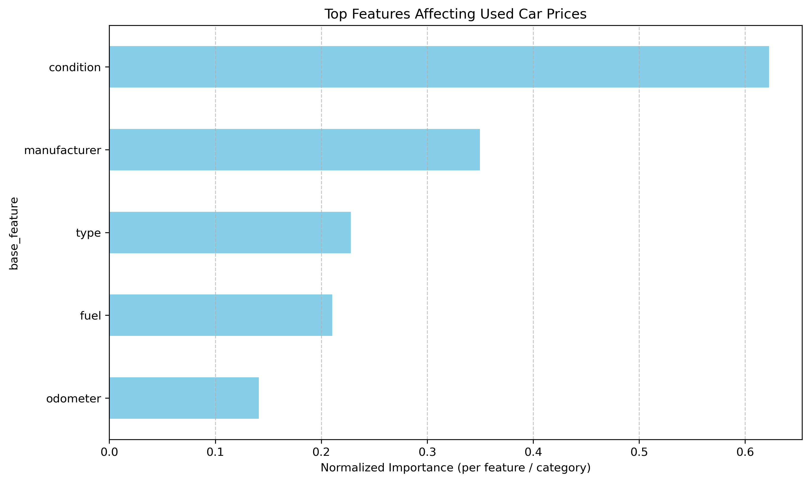

### Required Assignment 11.1: What drives the price of a car?

**Here are the list of observations and conclusions based from Jupyter Notebook**

Jupyter Notebook: [prompt.ipynb](https://github.com/shahcj/uc_ml_ai_assignments/blob/main/Module11/prompt.ipynb)

**Observations:**
* The data consists of 426,880 rows and 18 columns. Based on the value counts observed, we had to make following code cleaning:
    * We started with 7 columns price, manufacturer, model, condition, fuel, odometer, and type
    * We only included rows with price and odomoter above 0
    * We created derived features by using log on columns price and odometer
    * Instead of removing rows with values NaN, we calculated median on columns fuel and odomoter.
    * All the categorial columns like manufacturer, condition were updated with "Unknown" value where we had NaN
    * We used Linear Regression model to identify the features which impact the price of the car most.

**Conclusions:**

* We compared the price with features odometer, manufacturer, condition, fuel, and type
* We removed model from the ML Model as it had 1000's of different values and it was impacting the model badly.
* After running the model, we found that condition of the car and manufacturer are the top 2 features which impacts the car prices the most.

Here is the chart with comparison:

